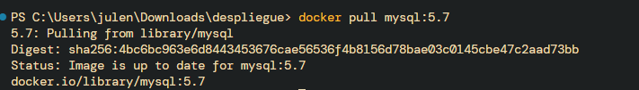

# MANUAL TÉCNICO


***Julen Agüero Fernández***

---

## Docker Desktop

Para comenzar, navegaremos a la página de Docker Desktop para instalarnos el software requerido.


Pasamos el ratón sobre el botón de "Download Docker Desktop" y seleccionamos el funcional para nuestro sistema operativo.


---

Una vez descargado iniciamos la aplicación, al abrirla nos mostrará algo parecido a la siguiente información.


---

## Estructura Proyecto

Debido a que mi proyecto estaba divido en 3 carpetas:

* Frontend
* Backend
* FileServer

He tenido que juntar todo en uno para facilitar el proceso del despliegue.


A nivel de ruta podemos encontrar dos archivos:

* .env
* docker-compose.yml

#### .ENV 

Este archivo contendra las variables que almacenarán las credenciales de acceso a la base de datos.

---

#### Docker-compose.yml

Este archivo guiará a Docker a la hora de realizar el despliegue, la estructura es la siguiente:

1. En primer lugar encontramos los servicios

`services:`

2. Dentro del componente de servicios creamos los servicios que desplegaremos después

`frontend: | backend: | fileServer: | db:`

##### Estructura

---

\- ***build:***

    \- context:  -> Indica la carpeta que debe hacer build

    \- ports: -> Indica el puerto donde correrá el servicio establecido

    \- networks: -> De forma predeterminada, Compose configura una única [red](https://docs.docker.com/reference/cli/docker/network/create/) para tu aplicación. Cada contenedor de un servicio se une a la red predeterminada y es accesible para otros contenedores de esa red y detectable por el nombre del servicio.

    \- depends_on: -> Con este `depends_on` atributo, se puede controlar el orden de inicio y cierre del servicio. Resulta útil si los servicios están estrechamente acoplados y la secuencia de inicio afecta la funcionalidad de la aplicación.

    \- enviroment: -> En esta sección se establecerán las variables privadas establecidas en los archivos "`.env`", en mi caso: DRIVER=mysql | HOST=db |PORT=3306 | DATABASE=newtube | USER=root | PASSWORD=

    \- command: -> Comandos a ejecutar durante la creacion del build del servicio seleccionado

    \- image: -> Especifica la imagen desde la que se iniciará el contenedor. Puede ser un repositorio/etiqueta, un resumen o un ID de imagen local.

\- ***networks:***

    - mynetwork: -> Red compartida por varios servicios

**\- volumes:**

    \- db_data: -> Volúmen con nombre que se comparte entre varios servicios.

---

##### Código

```yml
services:
  frontend:
    build:
      context: ./Frontend  
    ports:
      - "8080:80"
    networks:
      - mynetwork
    depends_on:
      - backend

  backend:
    build:
      context: ./Backend
    ports:
      - "8081:80"
    environment:
      - DRIVER=mysql
      - HOST=db
      - PORT=3306
      - DATABASE=newtube
      - USER=root
      - PASSWORD=
    networks:
      - mynetwork
    depends_on:
      - db
    command: ["./wait-for-it.sh", "db:3306", "--", "apache2-foreground"]

  fileServer:
    build:
      context: ./FileServer
    image: despliegue-fileserver
    ports:
      - "8082:80"
    environment:
      - DRIVER=mysql
      - HOST=db
      - PORT=3306
      - DATABASE=newtube
      - USER=root
      - PASSWORD=
    volumes:
      - ./FileServer/static:/var/www/html/static
    networks:
      - mynetwork
    depends_on:
      - db

  db:
    image: mysql:5.7
    environment:
      MYSQL_ALLOW_EMPTY_PASSWORD: "yes" 
      MYSQL_DATABASE: newtube
    ports:
      - "3307:3306"
    volumes:
      - db_data:/var/lib/mysql
      - ./db/init.sql:/docker-entrypoint-initdb.d/init.sql
    networks:
      - mynetwork

networks:
  mynetwork:
    driver: bridge

volumes:
  db_data:

```


---


## Proyectos

Cada proyecto consta de un Dockerfile.

#### Backend


##### Explicación del Dockerfile

Este `Dockerfile` construye una imagen Docker para el backend en PHP que utiliza Apache como servidor web, Composer como gestor de dependencias, y se conecta a una base de datos MySQL.

Además contiene un ejecutable para esperar a que termine el build de la base de datos y así realizar el build del backend sin ningún problema.

```

FROM php:8.2-apache


RUN apt-get update && apt-get install -y unzip git curl \
    && docker-php-ext-install mysqli pdo pdo_mysql \
    && a2enmod rewrite \
    && rm -rf /var/lib/apt/lists/*


RUN curl -sS https://getcomposer.org/installer | php -- --install-dir=/usr/local/bin --filename=composer


WORKDIR /var/www/html


COPY composer.json composer.lock ./
RUN composer install --no-dev --optimize-autoloader


COPY . .


RUN sed -i 's|DocumentRoot /var/www/html|DocumentRoot /var/www/html/endpoints|' /etc/apache2/sites-available/000-default.conf


COPY wait-for-it.sh /usr/local/bin/wait-for-it.sh
RUN chmod +x /usr/local/bin/wait-for-it.sh


EXPOSE 80


CMD ["wait-for-it.sh", "db:3306", "--", "apache2-foreground"]

```

---

#### FileServer


##### Explicación del Dockerfile

Este `Dockerfile` construye una imagen Docker para el fileserver en PHP que utiliza Apache como servidor web, Composer como gestor de dependencias, y se conecta a una base de datos MySQL.

También se establece los tamaños máximos permitidos para los archivos que se suban en el fileserver, junto el tiempo máximo de espera por cada petición.

```
FROM php:8.2-apache


RUN apt-get update && apt-get install -y unzip git curl \
    && a2enmod rewrite \
    && docker-php-ext-install mysqli pdo pdo_mysql \
    && rm -rf /var/lib/apt/lists/*


RUN curl -sS https://getcomposer.org/installer | php -- --install-dir=/usr/local/bin --filename=composer

WORKDIR /var/www/html


COPY composer.json composer.lock ./
RUN composer install --no-dev --optimize-autoloader


COPY . .


RUN echo "post_max_size = 100M" >> /usr/local/etc/php/conf.d/uploads.ini
RUN echo "upload_max_filesize = 100M" >> /usr/local/etc/php/conf.d/uploads.ini

RUN echo "max_execution_time = 300" >> /usr/local/etc/php/conf.d/uploads.ini


EXPOSE 80

CMD ["apache2-foreground"]

```

---

#### Frontend


##### Explicación del Dockerfile

Este `Dockerfile` construye una imagen Docker para el frontend usando node para compilar y construir el build de Tailwind para generar el css con los estilos.

```
FROM node:18 AS builder

WORKDIR /app

COPY package*.json ./

RUN npm install

COPY . .

RUN npm run build

RUN ls -la ./dist

FROM nginx:alpine

COPY --from=builder /app/dist /usr/share/nginx/html

COPY --from=builder /app/src/ /usr/share/nginx/html/

EXPOSE 80

```

---

#### DB

Carpeta donde se encontrará el archivo SQL que se encargará de crear las tablas, relaciones, insertar datos, etc...


Archivo exportado usando mysqldump:

```sql
-- MySQL dump 10.13  Distrib 5.7.44, for Linux (x86_64)
--
-- Host: localhost    Database: newtube
-- ------------------------------------------------------
-- Server version	5.7.44

/*!40101 SET @OLD_CHARACTER_SET_CLIENT=@@CHARACTER_SET_CLIENT */;
/*!40101 SET @OLD_CHARACTER_SET_RESULTS=@@CHARACTER_SET_RESULTS */;
/*!40101 SET @OLD_COLLATION_CONNECTION=@@COLLATION_CONNECTION */;
/*!40101 SET NAMES utf8 */;
/*!40103 SET @OLD_TIME_ZONE=@@TIME_ZONE */;
/*!40103 SET TIME_ZONE='+00:00' */;
/*!40014 SET @OLD_UNIQUE_CHECKS=@@UNIQUE_CHECKS, UNIQUE_CHECKS=0 */;
/*!40014 SET @OLD_FOREIGN_KEY_CHECKS=@@FOREIGN_KEY_CHECKS, FOREIGN_KEY_CHECKS=0 */;
/*!40101 SET @OLD_SQL_MODE=@@SQL_MODE, SQL_MODE='NO_AUTO_VALUE_ON_ZERO' */;
/*!40111 SET @OLD_SQL_NOTES=@@SQL_NOTES, SQL_NOTES=0 */;

--
-- Table structure for table `canales`
--

DROP TABLE IF EXISTS `canales`;
/*!40101 SET @saved_cs_client     = @@character_set_client */;
/*!40101 SET character_set_client = utf8 */;
CREATE TABLE `canales` (
  `id` int(11) NOT NULL AUTO_INCREMENT,
  `usuario_id` int(11) NOT NULL,
  `nombre_canal` varchar(255) NOT NULL,
  `descripcion` text,
  `portada` varchar(255) NOT NULL,
  PRIMARY KEY (`id`),
  UNIQUE KEY `nombre_canal` (`nombre_canal`),
  KEY `usuario_id` (`usuario_id`),
  CONSTRAINT `canales_ibfk_1` FOREIGN KEY (`usuario_id`) REFERENCES `usuarios` (`id`)
) ENGINE=InnoDB AUTO_INCREMENT=6 DEFAULT CHARSET=utf8mb4;
/*!40101 SET character_set_client = @saved_cs_client */;

--
-- Dumping data for table `canales`
--

LOCK TABLES `canales` WRITE;
/*!40000 ALTER TABLE `canales` DISABLE KEYS */;
INSERT INTO `canales` VALUES (1,1,'@MoureDev-kqlzW',NULL,'http://localhost:8082/static/portadas/portada_newtube9.webp'),(2,2,'@Pajaro555-wA5IH',NULL,'http://localhost:8082/static/portadas/portada_newtube8.webp'),(3,3,'@Julen17-DSCCw',NULL,'http://localhost:8082/static/portadas/portada_newtube7.webp'),(4,4,'@ELPAIS-EZDpj',NULL,'http://localhost:8082/static/portadas/portada_newtube3.webp'),(5,5,'@PlayQuiz-CkQuq','Hola a todos.','http://localhost:8082/static/portadas/portada_newtube3.webp');
/*!40000 ALTER TABLE `canales` ENABLE KEYS */;
UNLOCK TABLES;

--
-- Table structure for table `categorias`
--

DROP TABLE IF EXISTS `categorias`;
/*!40101 SET @saved_cs_client     = @@character_set_client */;
/*!40101 SET character_set_client = utf8 */;
CREATE TABLE `categorias` (
  `id` int(11) NOT NULL AUTO_INCREMENT,
  `nombre` varchar(255) NOT NULL,
  PRIMARY KEY (`id`)
) ENGINE=InnoDB AUTO_INCREMENT=26 DEFAULT CHARSET=utf8mb4;
/*!40101 SET character_set_client = @saved_cs_client */;

--
-- Dumping data for table `categorias`
--

LOCK TABLES `categorias` WRITE;
/*!40000 ALTER TABLE `categorias` DISABLE KEYS */;
INSERT INTO `categorias` VALUES (1,'Ciencia'),(2,'Tecnología'),(3,'Matemáticas'),(4,'Filosofía'),(5,'Arte'),(6,'Historia'),(7,'Literatura'),(8,'Música'),(9,'Deportes'),(10,'Geografía'),(11,'Psicología'),(12,'Economía'),(13,'Política'),(14,'Salud'),(15,'Sociología'),(16,'Educación'),(17,'Medicina'),(18,'Derecho'),(19,'Arquitectura'),(20,'Biología'),(21,'Ingeniería'),(22,'Astronomía'),(23,'Química'),(24,'Física'),(25,'Antropología');
/*!40000 ALTER TABLE `categorias` ENABLE KEYS */;
UNLOCK TABLES;

--
-- Table structure for table `comentarios`
--

DROP TABLE IF EXISTS `comentarios`;
/*!40101 SET @saved_cs_client     = @@character_set_client */;
/*!40101 SET character_set_client = utf8 */;
CREATE TABLE `comentarios` (
  `id` int(11) NOT NULL AUTO_INCREMENT,
  `video_id` int(11) NOT NULL,
  `usuario_id` int(11) NOT NULL,
  `contenido` text NOT NULL,
  `identificador` varchar(32) NOT NULL,
  `tipo` varchar(255) NOT NULL DEFAULT 'padre',
  `fecha_publicacion` datetime DEFAULT CURRENT_TIMESTAMP,
  PRIMARY KEY (`id`),
  UNIQUE KEY `identificador` (`identificador`),
  KEY `video_id` (`video_id`),
  KEY `usuario_id` (`usuario_id`),
  CONSTRAINT `comentarios_ibfk_1` FOREIGN KEY (`video_id`) REFERENCES `videos` (`id`) ON DELETE CASCADE ON UPDATE CASCADE,
  CONSTRAINT `comentarios_ibfk_2` FOREIGN KEY (`usuario_id`) REFERENCES `usuarios` (`id`)
) ENGINE=InnoDB AUTO_INCREMENT=4 DEFAULT CHARSET=utf8mb4;
/*!40101 SET character_set_client = @saved_cs_client */;

--
-- Dumping data for table `comentarios`
--

LOCK TABLES `comentarios` WRITE;
/*!40000 ALTER TABLE `comentarios` DISABLE KEYS */;
INSERT INTO `comentarios` VALUES (1,4,2,'Como es posible ??','bzUfO2s8w6JdKJSVHr3a1SQ0UqNBvp3B','padre','2025-06-16 10:01:20'),(2,13,4,'No esperaba ese final!','cvvkIkhoQCs87Ov3FiP2jMSYiTpO4xnM','padre','2025-06-16 10:53:58'),(3,18,3,'Gracias','r4S4isCGXndBYqoQheuSgLNn7vrsREPl','padre','2025-06-16 11:20:34');
/*!40000 ALTER TABLE `comentarios` ENABLE KEYS */;
UNLOCK TABLES;

--
-- Table structure for table `comentarios_gustados`
--

DROP TABLE IF EXISTS `comentarios_gustados`;
/*!40101 SET @saved_cs_client     = @@character_set_client */;
/*!40101 SET character_set_client = utf8 */;
CREATE TABLE `comentarios_gustados` (
  `id` int(11) NOT NULL AUTO_INCREMENT,
  `usuario_id` int(11) NOT NULL,
  `comentario_id` int(11) NOT NULL,
  `gustado` enum('si','no') NOT NULL,
  `fecha` datetime DEFAULT CURRENT_TIMESTAMP,
  PRIMARY KEY (`id`),
  KEY `usuario_id` (`usuario_id`),
  KEY `fk_comentario_id` (`comentario_id`),
  CONSTRAINT `comentarios_gustados_ibfk_1` FOREIGN KEY (`usuario_id`) REFERENCES `usuarios` (`id`),
  CONSTRAINT `fk_comentario_id` FOREIGN KEY (`comentario_id`) REFERENCES `comentarios` (`id`)
) ENGINE=InnoDB DEFAULT CHARSET=utf8mb4;
/*!40101 SET character_set_client = @saved_cs_client */;

--
-- Dumping data for table `comentarios_gustados`
--

LOCK TABLES `comentarios_gustados` WRITE;
/*!40000 ALTER TABLE `comentarios_gustados` DISABLE KEYS */;
/*!40000 ALTER TABLE `comentarios_gustados` ENABLE KEYS */;
UNLOCK TABLES;

--
-- Table structure for table `comentarios_hijos_gustados`
--

DROP TABLE IF EXISTS `comentarios_hijos_gustados`;
/*!40101 SET @saved_cs_client     = @@character_set_client */;
/*!40101 SET character_set_client = utf8 */;
CREATE TABLE `comentarios_hijos_gustados` (
  `id` int(11) NOT NULL AUTO_INCREMENT,
  `usuario_id` int(11) NOT NULL,
  `comentario_id` int(11) NOT NULL,
  `gustado` enum('si','no') NOT NULL,
  `fecha` datetime DEFAULT CURRENT_TIMESTAMP,
  PRIMARY KEY (`id`),
  KEY `usuario_id` (`usuario_id`),
  KEY `comentario_id` (`comentario_id`),
  CONSTRAINT `comentarios_hijos_gustados_ibfk_1` FOREIGN KEY (`usuario_id`) REFERENCES `usuarios` (`id`),
  CONSTRAINT `comentarios_hijos_gustados_ibfk_2` FOREIGN KEY (`comentario_id`) REFERENCES `respuestas_comentarios` (`id`)
) ENGINE=InnoDB AUTO_INCREMENT=2 DEFAULT CHARSET=utf8mb4;
/*!40101 SET character_set_client = @saved_cs_client */;

--
-- Dumping data for table `comentarios_hijos_gustados`
--

LOCK TABLES `comentarios_hijos_gustados` WRITE;
/*!40000 ALTER TABLE `comentarios_hijos_gustados` DISABLE KEYS */;
/*!40000 ALTER TABLE `comentarios_hijos_gustados` ENABLE KEYS */;
UNLOCK TABLES;

--
-- Table structure for table `historial`
--

DROP TABLE IF EXISTS `historial`;
/*!40101 SET @saved_cs_client     = @@character_set_client */;
/*!40101 SET character_set_client = utf8 */;
CREATE TABLE `historial` (
  `id` int(11) NOT NULL AUTO_INCREMENT,
  `usuario_id` int(11) NOT NULL,
  `video_id` int(11) NOT NULL,
  `identificador` varchar(32) NOT NULL,
  `fecha_visualizacion` datetime DEFAULT CURRENT_TIMESTAMP,
  PRIMARY KEY (`id`),
  UNIQUE KEY `identificador` (`identificador`),
  KEY `usuario_id` (`usuario_id`),
  KEY `video_id` (`video_id`),
  CONSTRAINT `historial_ibfk_1` FOREIGN KEY (`usuario_id`) REFERENCES `usuarios` (`id`),
  CONSTRAINT `historial_ibfk_2` FOREIGN KEY (`video_id`) REFERENCES `videos` (`id`) ON DELETE CASCADE ON UPDATE CASCADE
) ENGINE=InnoDB AUTO_INCREMENT=26 DEFAULT CHARSET=utf8mb4;
/*!40101 SET character_set_client = @saved_cs_client */;

--
-- Dumping data for table `historial`
--

LOCK TABLES `historial` WRITE;
/*!40000 ALTER TABLE `historial` DISABLE KEYS */;
INSERT INTO `historial` VALUES (1,1,1,'UHOMREdEBFjPNZbgvCMj0rC3qV7BWINC','2025-06-16 09:47:20'),(3,1,3,'OxRu800vrJVGdlJ0NbkOHbMyHOajw8PM','2025-06-16 09:54:22'),(4,2,4,'818UImOYeKRKYabgIlb4mi6WwZ3gr7Mf','2025-06-16 10:00:51'),(5,3,5,'qbc2SWrGwB1AG2WgnIuDoxZt7hdFMs1t','2025-06-16 10:11:39'),(6,3,1,'gsGmn9UIpr2ps0HZMFNnpPnAHocSCwVP','2025-06-16 10:32:27'),(7,3,6,'IZRl0ckEh79iwcZLPTLW9pIxEf3vafhs','2025-06-16 10:36:35'),(8,3,7,'XspCLseKAeVQ6iKdwMdCg4sYDNJfE6PB','2025-06-16 10:39:01'),(9,3,8,'OMtbTiViHIcnASWGTvURrPu75rT2GGWT','2025-06-16 10:42:12'),(10,3,9,'gBi9s0dXUJ8ooVq6mkUb1cNexiKvBsm7','2025-06-16 10:44:05'),(11,4,10,'X8Wju3PVtXhsd6s5Ypn2XKoA3JjXrOyg','2025-06-16 10:47:37'),(12,4,12,'eZk6ubUVCKDmvliKcsv90u7pKGOMCbPz','2025-06-16 10:51:41'),(13,4,13,'0XE0lgIvVe8eUWyqSWauVnYi0SA1GHdT','2025-06-16 10:53:13'),(14,4,14,'uInqwHnZ4xotORJhlggkAKUd34gHvqW6','2025-06-16 10:55:38'),(15,4,15,'fNrujR0FuWqeMymzxTEqfSeqQZDO8Fpk','2025-06-16 10:57:36'),(16,5,9,'T0b8WzdD7n9XYxqDL0d6lgQMOEVavpX5','2025-06-16 11:07:59'),(17,5,4,'iiXjICdsQ2SoEzHlLYOjoyxq8hwVcZZ1','2025-06-16 11:08:33'),(18,5,15,'7OfWMz2DGzQwIpwGiXg5x3T1rhF0L3nS','2025-06-16 11:08:39'),(19,5,3,'fkI8W9sBF0uGYQq6gqMIlLbrWhJvUNDv','2025-06-16 11:11:04'),(20,5,13,'IroXLya9ODvFyIKrKGtSYQadwtjQVnrB','2025-06-16 11:11:08'),(21,5,17,'liq55N1rZorazhxRU1T3BwhdEfxjoU5t','2025-06-16 11:15:45'),(22,3,18,'4VXzyja59cuL7jFKPZe29H1ojdBMGvW7','2025-06-16 11:20:28'),(23,3,20,'gjoijOQHiNs393E3XT1i4CqwW16ACw4B','2025-06-16 11:24:56'),(24,3,4,'de3y8PenQtuG1gkKg8Q9UIa4KoYTutQk','2025-06-16 11:27:04'),(25,3,11,'r3At1GERMc1HMXGy3k57Y1kZImruFiFP','2025-06-16 11:27:44');
/*!40000 ALTER TABLE `historial` ENABLE KEYS */;
UNLOCK TABLES;

--
-- Table structure for table `notificaciones`
--

DROP TABLE IF EXISTS `notificaciones`;
/*!40101 SET @saved_cs_client     = @@character_set_client */;
/*!40101 SET character_set_client = utf8 */;
CREATE TABLE `notificaciones` (
  `id` int(11) NOT NULL AUTO_INCREMENT,
  `usuario_id` int(11) NOT NULL,
  `video_id` int(11) NOT NULL,
  `canal_id` int(11) NOT NULL,
  `enlace` varchar(255) NOT NULL,
  `leida` tinyint(1) NOT NULL DEFAULT '0',
  `fecha` datetime DEFAULT CURRENT_TIMESTAMP,
  PRIMARY KEY (`id`),
  KEY `usuario_id` (`usuario_id`),
  KEY `canal_id` (`canal_id`),
  KEY `notificaciones_ibfk_2` (`video_id`),
  CONSTRAINT `notificaciones_ibfk_1` FOREIGN KEY (`usuario_id`) REFERENCES `usuarios` (`id`),
  CONSTRAINT `notificaciones_ibfk_2` FOREIGN KEY (`video_id`) REFERENCES `videos` (`id`) ON DELETE CASCADE ON UPDATE CASCADE,
  CONSTRAINT `notificaciones_ibfk_3` FOREIGN KEY (`canal_id`) REFERENCES `canales` (`id`)
) ENGINE=InnoDB DEFAULT CHARSET=utf8mb4;
/*!40101 SET character_set_client = @saved_cs_client */;

--
-- Dumping data for table `notificaciones`
--

LOCK TABLES `notificaciones` WRITE;
/*!40000 ALTER TABLE `notificaciones` DISABLE KEYS */;
/*!40000 ALTER TABLE `notificaciones` ENABLE KEYS */;
UNLOCK TABLES;

--
-- Table structure for table `respuestas_comentarios`
--

DROP TABLE IF EXISTS `respuestas_comentarios`;
/*!40101 SET @saved_cs_client     = @@character_set_client */;
/*!40101 SET character_set_client = utf8 */;
CREATE TABLE `respuestas_comentarios` (
  `id` int(11) NOT NULL AUTO_INCREMENT,
  `comentario_padre_id` int(11) NOT NULL,
  `usuario_id` int(11) NOT NULL,
  `contenido` text NOT NULL,
  `identificador` varchar(32) NOT NULL,
  `tipo` varchar(255) NOT NULL DEFAULT 'hijo',
  `fecha_publicacion` datetime DEFAULT CURRENT_TIMESTAMP,
  PRIMARY KEY (`id`),
  UNIQUE KEY `identificador` (`identificador`),
  KEY `comentario_padre_id` (`comentario_padre_id`),
  KEY `usuario_id` (`usuario_id`),
  CONSTRAINT `respuestas_comentarios_ibfk_1` FOREIGN KEY (`comentario_padre_id`) REFERENCES `comentarios` (`id`),
  CONSTRAINT `respuestas_comentarios_ibfk_2` FOREIGN KEY (`usuario_id`) REFERENCES `usuarios` (`id`)
) ENGINE=InnoDB AUTO_INCREMENT=2 DEFAULT CHARSET=utf8mb4;
/*!40101 SET character_set_client = @saved_cs_client */;

--
-- Dumping data for table `respuestas_comentarios`
--

LOCK TABLES `respuestas_comentarios` WRITE;
/*!40000 ALTER TABLE `respuestas_comentarios` DISABLE KEYS */;
INSERT INTO `respuestas_comentarios` VALUES (1,2,4,'Yo tampoco','vyKSfpD9a83rqqfqWxGKyhppauLvVXmX','hijo','2025-06-16 10:54:03');
/*!40000 ALTER TABLE `respuestas_comentarios` ENABLE KEYS */;
UNLOCK TABLES;

--
-- Table structure for table `suscripciones`
--

DROP TABLE IF EXISTS `suscripciones`;
/*!40101 SET @saved_cs_client     = @@character_set_client */;
/*!40101 SET character_set_client = utf8 */;
CREATE TABLE `suscripciones` (
  `id` int(11) NOT NULL AUTO_INCREMENT,
  `usuario_id` int(11) NOT NULL,
  `canal_id` int(11) NOT NULL,
  `fecha` datetime DEFAULT CURRENT_TIMESTAMP,
  PRIMARY KEY (`id`),
  KEY `usuario_id` (`usuario_id`),
  KEY `canal_id` (`canal_id`),
  CONSTRAINT `suscripciones_ibfk_1` FOREIGN KEY (`usuario_id`) REFERENCES `usuarios` (`id`),
  CONSTRAINT `suscripciones_ibfk_2` FOREIGN KEY (`canal_id`) REFERENCES `canales` (`id`)
) ENGINE=InnoDB AUTO_INCREMENT=4 DEFAULT CHARSET=utf8mb4;
/*!40101 SET character_set_client = @saved_cs_client */;

--
-- Dumping data for table `suscripciones`
--

LOCK TABLES `suscripciones` WRITE;
/*!40000 ALTER TABLE `suscripciones` DISABLE KEYS */;
INSERT INTO `suscripciones` VALUES (1,5,2,'2025-06-16 11:10:40'),(2,5,1,'2025-06-16 11:11:05'),(3,5,4,'2025-06-16 11:11:09');
/*!40000 ALTER TABLE `suscripciones` ENABLE KEYS */;
UNLOCK TABLES;

--
-- Table structure for table `usuarios`
--

DROP TABLE IF EXISTS `usuarios`;
/*!40101 SET @saved_cs_client     = @@character_set_client */;
/*!40101 SET character_set_client = utf8 */;
CREATE TABLE `usuarios` (
  `id` int(11) NOT NULL AUTO_INCREMENT,
  `nombre` varchar(255) NOT NULL,
  `email` varchar(255) NOT NULL,
  `password` varchar(255) NOT NULL,
  `identificador` varchar(32) NOT NULL,
  `avatar` varchar(255) NOT NULL,
  `pais` varchar(100) DEFAULT NULL,
  `fecha_registro` datetime DEFAULT CURRENT_TIMESTAMP,
  `fecha_actualizado` datetime DEFAULT CURRENT_TIMESTAMP ON UPDATE CURRENT_TIMESTAMP,
  PRIMARY KEY (`id`),
  UNIQUE KEY `email` (`email`),
  UNIQUE KEY `identificador` (`identificador`)
) ENGINE=InnoDB AUTO_INCREMENT=6 DEFAULT CHARSET=utf8mb4;
/*!40101 SET character_set_client = @saved_cs_client */;

--
-- Dumping data for table `usuarios`
--

LOCK TABLES `usuarios` WRITE;
/*!40000 ALTER TABLE `usuarios` DISABLE KEYS */;
INSERT INTO `usuarios` VALUES (1,'MoureDev','moure@gmail.com','$2y$10$iJ/golzU1LebFt2sB/gKZ.e3OdaA508eSyVh7sOGTW9lwWW50FtcG','v4Mt59urhZAL2HLyChBQGMSewyb8NOxU','http://localhost:8082/static/usuarios/newtube_avatar4.webp',NULL,'2025-06-16 09:46:08','2025-06-16 09:46:08'),(2,'Pajaro555','pajaro@gmail.com','$2y$10$9/DvL9CtDeLOkZT.r9bKyOlQ8.MlHfgF171TFSmRJxexatGDuuxVi','RB81wESvYQTDurvfQeepql5i1KPB7nst','http://localhost:8082/static/usuarios/newtube_avatar3.webp',NULL,'2025-06-16 09:58:29','2025-06-16 09:58:29'),(3,'Julen17','julen@gmail.com','$2y$10$vBtdDr3kDmqiGpmnxjEAxeiJKJs6OkRie31DvnAfySo3M5Fx/kBGO','maiQmThOfSpyPtm0OFYV1mwGU5qR4Psx','http://localhost:8082/static/usuarios/newtube_avatar6.webp',NULL,'2025-06-16 10:01:50','2025-06-16 10:04:35'),(4,'ELPAIS','pais@gmail.com','$2y$10$tDVUObsQ7eFkJugQ6pm7rOLaRuVOTf2xiEVh61yFb0ZHYKUXFaS6.','2JimhwGKGcSHrhptycegz4b0TpLbixHz','http://localhost:8082/static/usuarios/newtube_avatar8.webp',NULL,'2025-06-16 10:46:12','2025-06-16 10:46:12'),(5,'PlayQuiz','quiz@gmail.com','$2y$10$soFahs2UeifIG48PEAqQJumW5R88NhjCMyp8rXd3oks6CHmBVs5pm','cC5KJgkKY0bLdJ8RWAGBZHn6oousIrfk','http://localhost:8082/static/usuarios/newtube_avatar6.webp',NULL,'2025-06-16 10:58:29','2025-06-16 10:58:29');
/*!40000 ALTER TABLE `usuarios` ENABLE KEYS */;
UNLOCK TABLES;

--
-- Table structure for table `videos`
--

DROP TABLE IF EXISTS `videos`;
/*!40101 SET @saved_cs_client     = @@character_set_client */;
/*!40101 SET character_set_client = utf8 */;
CREATE TABLE `videos` (
  `id` int(11) NOT NULL AUTO_INCREMENT,
  `canal_id` int(11) NOT NULL,
  `titulo` varchar(255) NOT NULL,
  `descripcion` text NOT NULL,
  `categoria_id` int(11) NOT NULL,
  `video` varchar(255) NOT NULL,
  `identificador` varchar(32) NOT NULL,
  `miniatura` varchar(255) NOT NULL,
  `visitas` int(11) NOT NULL DEFAULT '0',
  `duracion` int(20) NOT NULL,
  `estado` enum('publico','privado') NOT NULL,
  `fecha_creacion` datetime DEFAULT CURRENT_TIMESTAMP,
  `fecha_actualizado` datetime DEFAULT CURRENT_TIMESTAMP ON UPDATE CURRENT_TIMESTAMP,
  PRIMARY KEY (`id`),
  UNIQUE KEY `identificador` (`identificador`),
  KEY `canal_id` (`canal_id`),
  KEY `categoria_id` (`categoria_id`),
  CONSTRAINT `videos_ibfk_1` FOREIGN KEY (`canal_id`) REFERENCES `canales` (`id`),
  CONSTRAINT `videos_ibfk_2` FOREIGN KEY (`categoria_id`) REFERENCES `categorias` (`id`)
) ENGINE=InnoDB AUTO_INCREMENT=21 DEFAULT CHARSET=utf8mb4;
/*!40101 SET character_set_client = @saved_cs_client */;

--
-- Dumping data for table `videos`
--

LOCK TABLES `videos` WRITE;
/*!40000 ALTER TABLE `videos` DISABLE KEYS */;
INSERT INTO `videos` VALUES (1,1,'La Única manera de Aprender Programación desde cero','Esta es la realidad sobre aprender a programar de manera efectiva que nadie te suele contar. Así es como debes estudiar programación.\r\n\r\n? Tienes el curso completo \"Cómo Estudiar Programación\" en https://mouredev.pro/cursos/como-estu...\r\n▶ Junto a más curso',3,'http://localhost:8082/static/videos/8uBtw3szqziHCV7KLAJdb83m5GjAijQd.mp4','8uBtw3szqziHCV7KLAJdb83m5GjAijQd','http://localhost:8082/static/miniaturas/8uBtw3szqziHCV7KLAJdb83m5GjAijQd.jpg',2,557,'publico','2025-06-16 09:47:14','2025-06-16 10:32:27'),(3,1,'Curso de SQL y Bases de Datos desde cero | Ya disponible en mouredev pro','Aprende los fundamentos del lenguaje SQL y las bases de datos relacionales.\r\n? Tienes el curso en mi nuevo campus de programación: https://mouredev.pro\r\nCursos, ejercicios, test, certificados, soporte, comunidad y mucho más.\r\n(Usa el cupón \"PRO\" para ahorra',12,'http://localhost:8082/static/videos/WTqK9lIymW5pyxBJbzSt3i2pDrs3gxJG.mp4','WTqK9lIymW5pyxBJbzSt3i2pDrs3gxJG','http://localhost:8082/static/miniaturas/WTqK9lIymW5pyxBJbzSt3i2pDrs3gxJG.jpg',2,203,'publico','2025-06-16 09:54:20','2025-06-16 11:11:04'),(4,2,'This Bird\'s Wing Flapping Is Synced With A Camera\'s Frame Rate And It\'s Mind Boggling','This Bird\'s Wing Flapping Is Synced With A Camera\'s Frame Rate And It\'s Mind Boggling',20,'http://localhost:8082/static/videos/CkBoo5dLakrvCBbxoiIoKSSXupL1gDZl.mp4','CkBoo5dLakrvCBbxoiIoKSSXupL1gDZl','http://localhost:8082/static/miniaturas/CkBoo5dLakrvCBbxoiIoKSSXupL1gDZl.webp',3,23,'publico','2025-06-16 10:00:46','2025-06-16 11:27:04'),(5,3,'Como quitar una rana de un mando de **XBOX**','En este tutorial enseñaremos como quitar una rana de un mando de XBOX, muy fácil.',5,'http://localhost:8082/static/videos/ksBbr6Kb0LcO19s2Zppyl3ySOQN6Xtka.mp4','ksBbr6Kb0LcO19s2Zppyl3ySOQN6Xtka','http://localhost:8082/static/miniaturas/ksBbr6Kb0LcO19s2Zppyl3ySOQN6Xtka.webp',1,33,'publico','2025-06-16 10:11:11','2025-06-16 10:11:39'),(6,3,'EL PEOR BOCADILLO QUE VERÁS HOY','Today I show you how to make homemade smash burgers. This classic smash burger recipe is one of my absolute favourites. Smash burgers are incredibly easy to make. I guarantee this will be the best smash burger you will ever try. This is the authentic and ',14,'http://localhost:8082/static/videos/KLsZ7E9KtJSwTr661YPxkhchbZjVCCXT.mp4','KLsZ7E9KtJSwTr661YPxkhchbZjVCCXT','http://localhost:8082/static/miniaturas/KLsZ7E9KtJSwTr661YPxkhchbZjVCCXT.webp',1,125,'publico','2025-06-16 10:36:28','2025-06-16 10:36:35'),(7,3,'SALTANDO EN PARACAIDAS DESDE UNA AVIONETA A 30000 PIES DE ALTURA','Estoy loco',1,'http://localhost:8082/static/videos/CD6S8wfotKxKUapRoW8znIrkZzlLRvz6.mp4','CD6S8wfotKxKUapRoW8znIrkZzlLRvz6','http://localhost:8082/static/miniaturas/CD6S8wfotKxKUapRoW8znIrkZzlLRvz6.webp',1,76,'publico','2025-06-16 10:38:58','2025-06-16 10:39:01'),(8,3,'Volando desde Tokia a San Francisco en 83 segundos','Over 3,400 separate images combined to make this time lapse video from a Boeing 747-400 en route from Tokyo\'s Narita Airport to San Francisco.\r\n\r\nDon\'t miss the sunrise chasing Venus.\r\n\r\n\"A Courageous Light Instrumental\" \r\nComposed by Adam Michaels.  \r\nLicensed',10,'http://localhost:8082/static/videos/wPzdwK92emAcboaficGIXam2klg51izX.mp4','wPzdwK92emAcboaficGIXam2klg51izX','http://localhost:8082/static/miniaturas/wPzdwK92emAcboaficGIXam2klg51izX.webp',1,84,'publico','2025-06-16 10:42:03','2025-06-16 10:42:12'),(9,3,'ANUNCIO EMIRATOS ÁRABES UNIDOS','We did it again…only better! Watch behind the scenes to see how we took our A380 for a spin around the Burj Khalifa for the making of our new advertisement.',13,'http://localhost:8082/static/videos/gJIh1mF2pflKWm4WRYNdMGXDkOekphfT.mp4','gJIh1mF2pflKWm4WRYNdMGXDkOekphfT','http://localhost:8082/static/miniaturas/gJIh1mF2pflKWm4WRYNdMGXDkOekphfT.webp',2,75,'publico','2025-06-16 10:44:03','2025-06-16 11:07:59'),(10,4,'HUMANOS CONTRA HORMIGAS: el experimento del laberinto | EL PAÍS','Solo hay dos tipos de animales capaces de transportar un objeto tan grande que solo pueden lograrlo cooperando y yendo a una: los humanos y las hormigas. Y no todas las 15.000 especies de formícidos saben hacer algo así.',20,'http://localhost:8082/static/videos/6R8G1a5BBQswBdXWYecFrBuqXvkDcLQ0.mp4','6R8G1a5BBQswBdXWYecFrBuqXvkDcLQ0','http://localhost:8082/static/miniaturas/6R8G1a5BBQswBdXWYecFrBuqXvkDcLQ0.webp',1,66,'publico','2025-06-16 10:47:34','2025-06-16 10:47:37'),(11,4,'Le quieren robar el Porsche pero no esperaban que el dueño fuese tan buen conductor','Ocurrió en Johannesburgo, (Sudáfrica)Más vídeos de EL PAÍS: http://cort.as/YGC9Síguenos:Facebook: ',15,'http://localhost:8082/static/videos/GPJGCqou2cEKD6ayZNKqPWPxwGquMcN0.mp4','GPJGCqou2cEKD6ayZNKqPWPxwGquMcN0','http://localhost:8082/static/miniaturas/GPJGCqou2cEKD6ayZNKqPWPxwGquMcN0.webp',1,43,'publico','2025-06-16 10:49:13','2025-06-16 11:27:44'),(12,4,'Stormtrooper Falls Down Stairs On The Way To Star Wars Premiere','Stormtrooper Falls Down Stairs.  That Is All.\r\n\r\n--\r\n\r\nFind out more @ www.thewoolshedcompany.com/virals\r\n\r\n\'Terry Tufferson\' Created By CASPAR MAZZOTTI\r\nDirected By RICHARD HUGHES & CASPAR MAZZOTTI\r\nProduced By DAVE CHRISTISON\r\n\r\nThe Woolshed Company Pty Ltd\r\nwww.t',4,'http://localhost:8082/static/videos/TFjrH90JbUaE4RXf63tvymSjh7kibhEY.mp4','TFjrH90JbUaE4RXf63tvymSjh7kibhEY','http://localhost:8082/static/miniaturas/TFjrH90JbUaE4RXf63tvymSjh7kibhEY.webp',1,28,'publico','2025-06-16 10:51:36','2025-06-16 10:51:41'),(13,4,'Most Popular Programming Languages 1955 - 2025','These are the most popular programming languages from 1955 to 2025, based on percentage of jobs. I used AI to get information and sample code for each language. The code is for a simple task--showing 10 consecutive numbers starting from 33, in order to sh',2,'http://localhost:8082/static/videos/j2mThqTWXKJL97xPNTS3z5qp4xB8LzbH.mp4','j2mThqTWXKJL97xPNTS3z5qp4xB8LzbH','http://localhost:8082/static/miniaturas/j2mThqTWXKJL97xPNTS3z5qp4xB8LzbH.webp',2,506,'publico','2025-06-16 10:53:10','2025-06-16 11:11:08'),(14,4,'Walk, Run, Crawl, RL Fun | Boston Dynamics | Atlas','In this video, Atlas is demonstrating policies developed using reinforcement learning with references from human motion capture and animation. This work was done as part of a research partnership between Boston Dynamics and the Robotics and AI Institute (',2,'http://localhost:8082/static/videos/Vn5VThss97vv5CQfE2XFVUPblsuYo51d.mp4','Vn5VThss97vv5CQfE2XFVUPblsuYo51d','http://localhost:8082/static/miniaturas/Vn5VThss97vv5CQfE2XFVUPblsuYo51d.webp',1,67,'publico','2025-06-16 10:55:36','2025-06-16 10:55:38'),(15,4,'ADIVINA LAS 197 BANDERAS | Guess the Flag Quiz','Guess the flag in 3 seconds! \r\n\r\nCan you guess the country by flag? And can you name all the 197 national flags of the world? Play this guess the flag challenge to find out! \r\n\r\nSubscribe for more quizzes, games, tests and challenges! \r\n\r\n\r\nCopyright Disclaimer:',22,'http://localhost:8082/static/videos/fUYpVu6yoYJYgFYrmCuaDbhA2asEVWot.mp4','fUYpVu6yoYJYgFYrmCuaDbhA2asEVWot','http://localhost:8082/static/miniaturas/fUYpVu6yoYJYgFYrmCuaDbhA2asEVWot.webp',2,1409,'publico','2025-06-16 10:57:34','2025-06-16 11:08:39'),(16,5,'ADIVINA LOS LOGOS DE LAS EMPRESAS EN 3 SEGUNDOS | 100 Famous Logos | Ultimate Logo Quiz','Can you guess all the 100 logos in 3 seconds? Find it out in this video! This video includes the most famous food logos, car logos, social media logos, tech logos and much more! Test your logo knowledge and see if you can get 100/100. Subscribe for more q',18,'http://localhost:8082/static/videos/cxhaeCTBeZCgmAFiwFqEtUm8jwPiGG44.mp4','cxhaeCTBeZCgmAFiwFqEtUm8jwPiGG44','http://localhost:8082/static/miniaturas/cxhaeCTBeZCgmAFiwFqEtUm8jwPiGG44.webp',0,688,'publico','2025-06-16 11:06:31','2025-06-16 11:06:31'),(17,5,'ADIVINA LA CELEBRIDAD EN 3 SEGUNDOS','Welcome to a new Quiz Plug video! In today\'s video, you have to guess the celebrity in 3 seconds. There are 100 celebrities for you to name including: IShowSpeed, MrBeast, Cristiano Ronaldo, Lionel Messi, Jenna Ortega, Ice Spice, Olivia Rodrigo, Ryan Gosl',8,'http://localhost:8082/static/videos/cbmWkOLowTvCVatT3u73Q6vg0QE1fQ2n.mp4','cbmWkOLowTvCVatT3u73Q6vg0QE1fQ2n','http://localhost:8082/static/miniaturas/cbmWkOLowTvCVatT3u73Q6vg0QE1fQ2n.webp',1,797,'publico','2025-06-16 11:15:44','2025-06-16 11:15:45'),(18,3,'Como hacer un Sándwich / Tutorial 2025','disfruten su sándwich',14,'http://localhost:8082/static/videos/Ksr1VOTr45MEPuL1rwzJoTeICWIPasCV.mp4','Ksr1VOTr45MEPuL1rwzJoTeICWIPasCV','http://localhost:8082/static/miniaturas/Ksr1VOTr45MEPuL1rwzJoTeICWIPasCV.jpg',1,111,'publico','2025-06-16 11:20:23','2025-06-16 11:20:28'),(19,3,'Gato realiza un salto increible','For licensing/usage please contact: licensing(at)jukinmedia.com',5,'http://localhost:8082/static/videos/Q3hrUQRWYZRbM2Lfv9kj6qQWNhVbTvjh.mp4','Q3hrUQRWYZRbM2Lfv9kj6qQWNhVbTvjh','http://localhost:8082/static/miniaturas/Q3hrUQRWYZRbM2Lfv9kj6qQWNhVbTvjh.jpg',0,12,'publico','2025-06-16 11:22:18','2025-06-16 11:22:18'),(20,3,'Animacion vs. Matemáticas','How much of this math do you know?\r\n\r\n? ASK ME ANYTHING! ► https://www.youtube.com/noogai89/join\r\n\r\n? MERCH! ► https://alanbecker.shop\r\n\r\n?DISCORD SERVER ►   / discord   \r\n\r\n?️ANIMATORS VS GAMES ►  @AnimatorsVSGames   \r\n\r\n?INSTAGRAM ►   / alanbecker   \r\n\r\n✏️TWIT',3,'http://localhost:8082/static/videos/LJTs6QYkYBBwQhu7K4xoSf7dkQh5fY2v.mp4','LJTs6QYkYBBwQhu7K4xoSf7dkQh5fY2v','http://localhost:8082/static/miniaturas/LJTs6QYkYBBwQhu7K4xoSf7dkQh5fY2v.webp',1,842,'publico','2025-06-16 11:24:50','2025-06-16 11:24:56');
/*!40000 ALTER TABLE `videos` ENABLE KEYS */;
UNLOCK TABLES;

--
-- Table structure for table `videos_guardados`
--

DROP TABLE IF EXISTS `videos_guardados`;
/*!40101 SET @saved_cs_client     = @@character_set_client */;
/*!40101 SET character_set_client = utf8 */;
CREATE TABLE `videos_guardados` (
  `id` int(11) NOT NULL AUTO_INCREMENT,
  `usuario_id` int(11) NOT NULL,
  `video_id` int(11) NOT NULL,
  `identificador` varchar(32) NOT NULL,
  `fecha` datetime DEFAULT CURRENT_TIMESTAMP,
  PRIMARY KEY (`id`),
  UNIQUE KEY `identificador` (`identificador`),
  KEY `usuario_id` (`usuario_id`),
  KEY `video_id` (`video_id`),
  CONSTRAINT `videos_guardados_ibfk_1` FOREIGN KEY (`usuario_id`) REFERENCES `usuarios` (`id`),
  CONSTRAINT `videos_guardados_ibfk_2` FOREIGN KEY (`video_id`) REFERENCES `videos` (`id`) ON DELETE CASCADE ON UPDATE CASCADE
) ENGINE=InnoDB DEFAULT CHARSET=utf8mb4;
/*!40101 SET character_set_client = @saved_cs_client */;

--
-- Dumping data for table `videos_guardados`
--

LOCK TABLES `videos_guardados` WRITE;
/*!40000 ALTER TABLE `videos_guardados` DISABLE KEYS */;
/*!40000 ALTER TABLE `videos_guardados` ENABLE KEYS */;
UNLOCK TABLES;

--
-- Table structure for table `videos_marcados`
--

DROP TABLE IF EXISTS `videos_marcados`;
/*!40101 SET @saved_cs_client     = @@character_set_client */;
/*!40101 SET character_set_client = utf8 */;
CREATE TABLE `videos_marcados` (
  `id` int(11) NOT NULL AUTO_INCREMENT,
  `usuario_id` int(11) NOT NULL,
  `video_id` int(11) NOT NULL,
  `identificador` varchar(32) NOT NULL,
  `gustado` enum('si','no') NOT NULL,
  `fecha` datetime DEFAULT CURRENT_TIMESTAMP,
  PRIMARY KEY (`id`),
  UNIQUE KEY `identificador` (`identificador`),
  KEY `usuario_id` (`usuario_id`),
  KEY `video_id` (`video_id`),
  CONSTRAINT `videos_marcados_ibfk_1` FOREIGN KEY (`usuario_id`) REFERENCES `usuarios` (`id`),
  CONSTRAINT `videos_marcados_ibfk_2` FOREIGN KEY (`video_id`) REFERENCES `videos` (`id`) ON DELETE CASCADE ON UPDATE CASCADE
) ENGINE=InnoDB AUTO_INCREMENT=3 DEFAULT CHARSET=utf8mb4;
/*!40101 SET character_set_client = @saved_cs_client */;

--
-- Dumping data for table `videos_marcados`
--

LOCK TABLES `videos_marcados` WRITE;
/*!40000 ALTER TABLE `videos_marcados` DISABLE KEYS */;
INSERT INTO `videos_marcados` VALUES (1,3,5,'HEMcMaNL0cIKb1HLEQyCNQJgZHZcvAHJ','si','2025-06-16 10:23:02'),(2,4,12,'e4SBdEYtZpWdNhNO8ZMFJCkF9mTbUCVG','si','2025-06-16 10:51:51');
/*!40000 ALTER TABLE `videos_marcados` ENABLE KEYS */;
UNLOCK TABLES;
/*!40103 SET TIME_ZONE=@OLD_TIME_ZONE */;

/*!40101 SET SQL_MODE=@OLD_SQL_MODE */;
/*!40014 SET FOREIGN_KEY_CHECKS=@OLD_FOREIGN_KEY_CHECKS */;
/*!40014 SET UNIQUE_CHECKS=@OLD_UNIQUE_CHECKS */;
/*!40101 SET CHARACTER_SET_CLIENT=@OLD_CHARACTER_SET_CLIENT */;
/*!40101 SET CHARACTER_SET_RESULTS=@OLD_CHARACTER_SET_RESULTS */;
/*!40101 SET COLLATION_CONNECTION=@OLD_COLLATION_CONNECTION */;
/*!40111 SET SQL_NOTES=@OLD_SQL_NOTES */;

-- Dump completed on 2025-06-16 12:14:20

```

---

#### Descargas previas

Antes de continuar con el despliegue, debemos instalar la imagen de mysql, para que docker pueda conectarse y crear el build correctamente.


Comando:

```bash
docker pull mysql:5.7
```

Como ya la descargué previamente me mostrará esto por consola:


---

#### Despliegue

Una vez establecido y descargado todo correctamente.

Ejecutamos el siguiente comando:

```bash
docker-compose up --build
```


En caso de que todo se haya creado correctamente veremos esos logs.
También podemos ejecutar:

```bash
docker ps
```

Para listar los servicios corriendo actualmente


Otra forma sería accediendo a Docker Desktop:

***Contenedores***


***Imagenes***


***Volumenes***


***Builds***


---

## Acceso

Ahora podemos acceder directamente a las URL establecidas mediante los puertos previamente seleccionados:

* Frontend (8080)


* Backend (8081)


* FileServer (8082)


