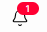
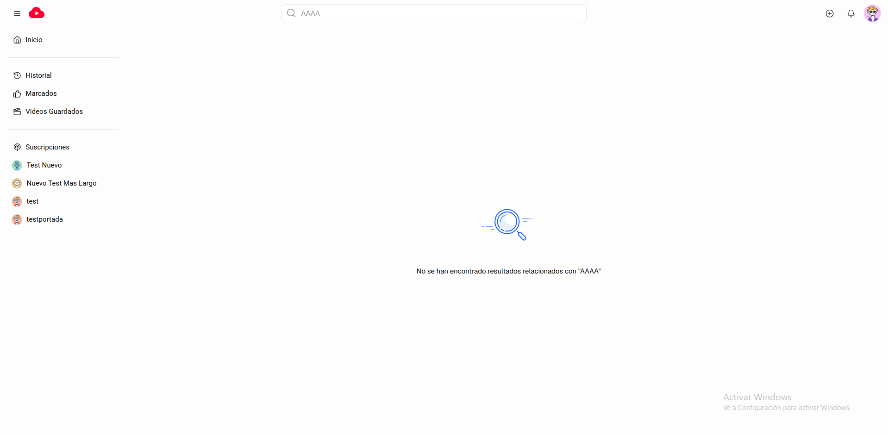
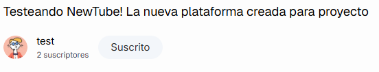
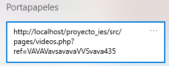
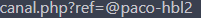

# MANUAL DE USUARIO

***Julen Agüero Fernández***

---

### Cabecera

La cabecera está formada por los siguientes componentes:

1. Menu (icono)
2. Logo de la aplicación
3. Barra de búsqueda
4. Botón para crear un nuevo video
5. Notificaciones
6. Perfil / Menu de usuario

---

#### Menu (icono)

El menu es un botón que permite minimizar y maximizar la barra lateral de la aplicación.

---

#### Logo de la aplicación

Es simplemente un link que te lleva a la página de inicio de la aplicación.

---

#### Barra de búsqueda

La barra de búsqueda permite encontrar y facilitar la búsqueda de videos y/o canales dentro, de la aplicación.

Por cada vez que el usuario realice una búsqueda se almacenará en el almacenamiento local del navegador, también conocido como `localStorage`. Lo que permitirá al usuario realizar de nuevo cualquiera de sus 10 últimas búsquedas. La barra de búsqueda tambien cuenta con un botón de limpiar, que quitará cualquier string situado dentro del input, y que solo se mostrará en caso de que haya más de cero letras en el input.

---

#### Botón para crear un nuevo video

Al hacer click en este botón aparecerá un menu con la opción de "Crear Nuevo Video", al presionar en este link se te redirigirá a la página para crear nuevos videos.

---

#### Notificaciones

Este botón con ese icono tan característico desplegará un menú que contendrá las notificaciones recibidas por parte del usuario en la `ÚLTIMA SEMANA` y mostrará información como:

* Avatar del usuario que creó el video
* Título del video
* Miniatura del video
* Hace cuanto se publicó

En cuanto a cómo se crean las notificaciones, cada vez que un canal cree un nuevo vídeo se enviará automaticamente una notificación con la información mencionada anteriormente.

Si es la primera vez que desplegan el menu y el usuario contiene notificaciones no leidas, se establecerán como leidas, por otro lado, las notificaciones leidas se mostrarán en la parte superior derecha junto al icono de las notificaciones.

---

#### Perfil / Menu de usuario

Este componente contiene a simple vista el avatar del usuario loggeado en la aplicación, este es un botón, que al hacer click, muestra la siguiente información:

* Avatar del usuario
* Nombre
* Nombre del canal

Junto con un link para visitar tu propio canal y un botón para cerrar sesión en la cuenta.

---

### Barra lateral

La barra lateral esta formada por un conjunto de links que facilitan la navegación dentro de la aplicación, estos links son:

1. Inicio
2. Historial
3. Marcados
4. Videos Guardados
5. Suscripciones
6. Listado 4 últimos canales siguiendo.

---

### Inicio ( Página principal )

En la página principal de la aplicación se mostrarán un serie de videos obtenidos aleatoriamente, para que el usuario empiece a navegar e interactuar dentro de la aplicación. Dentro de esta pantalla el usuario podrá seleccionar si quiere observar videos según su categoría o completamente aleatorios. En la parte superior se encuentra:

* Sin Categoría
* Con Categoría

El botón de "***Sin Categoría***" (por defecto) es el que mostrará una lista de videos aleatorios, por otro lado, los otros 5 botones serán de las categorías con más videos de toda la aplicación.

`SIN CATEGORÍA`

`CON CATEGORÍA`

Cada tarjeta resultará ser un link que te llevará al video en cuestión, en cuanto a la información que muestran:

* Miniatura
* Duración
* Título
* Avatar usuario
* Nombre usuario
* Num. Visualizaciones
* Fecha publicación

En caso de que todavia no haya ningún video y no se haya seleccionado ninguna categoría aparecera la siguiente pantalla:

---

Y en caso de que no haya ningún video pero si haya una categoría seleccionada se mostrará esta otra pantalla:

---

### Marcados

En esta página se mostrarán los videos y comentarios que el usuario ha marcado (me gusta / no me gusta).

Estarán separados por tabulaciones:

* Videos
* Comentarios

#### Videos

Aparecerán de forma listada los videos marcados ordernados de más recientes a más antiguos, mostrando:

1. Miniatura
2. Duración
3. Título
4. Num. Visualizaciones
5. Fecha publicación
6. Avatar usuario creador
7. Nombre creador
8. Estado Marcado `( ME GUSTA / NO ME GUSTA )`

Cada elemento es un link que te llevará al video original.

---

#### Comentarios

En esta segunda sección, se listarán los comentarios marcados del usuario mostrando la siguiente información:

1. Tipo `( PADRE -> ICONO PERSONA / HIJO -> ICONO FLECHA HACIA ARRIBA )`
2. Avatar usuario
3. Nombre usuario
4. Contenido comentario
5. Estado Marcado `( ME GUSTA / NO ME GUSTA )`
6. Fecha publicación

Cada comentario es un link que te llevará al video donde se escribió ese comentario.

---

### Suscripciones

Dentro de esta página aparecerán los canales a los que el usuario actual está suscrito, esta sección ofrece la posibilidad de visitar directamente el canal seleccionado, además debajo de cada canal se situa un botón "Quitar" que al hacer click ofrece la posibilidad de quitar la suscripción desde esta página

Si el usuario actual no está suscrito a ningún canal aparecerá la siguiente pantalla:

---

### Búsqueda

Al realizar un búsqueda en la barra situada en el header de la aplicación te redirigirá a una página nueva: `buscar.php`, con un parámetro en la url, el texto que introduciste. Una vez ya en la página se mostrarán todos los videos / canales que coincidan o que contengan el texto introducido en la barra de búsqueda.

#### Vídeos

Cada video mostrará:

1. Miniatura
2. Duración
3. Titulo
4. Num. Visualizaciones
5. Fecha publicación
6. Avatar usuario
7. Nombre usuario
8. Descripción video
9. Categoría video

Cada tarjeta de vídeo será un enlace que te llevará al correspondiente video.

---

#### Canales

Cada canal mostrará:

1. Avatar usuario
2. Nombre usuario
3. Nombre canal
4. Num. Total suscriptores
5. Descripción canal

Cada tarjeta de canal será un enlace que te llevara al correspondiente canal.

> En cuanto a la disposición de los resultados será completamente aleatoria por cada búsqueda.

#### Demostración

En caso de que no se encuentre ningún video ni ningún canal aparecerá la siguiente pantalla:

---

### Vídeos

Dentro de esta página el usuario podra observar una gran cantidad de elementos entre ellos destacan:

1. Reproductor de video
2. Información del video
3. Videos recomendados
4. Sección de comentarios

> Al entrar en esta página se comprueba si:
>
> * El usuario ha visto el video (para aumentar o no las visualizaciones)
> * Contiene el video guardado `( GUARDADO / NO GUARDADO )`
> * Tiene marcado el video `( GUSTADO / NO GUSTADO )`
> * Estado `( PUBLICO / PRIVADO)` --> Llevará al usuario a la página 404 en caso de que el video sea privado.
> * Si el usuario actual (loggeado) es propietario del video
> * Si es suscriptor o no.

#### Reproductor de vídeo

Los controles del reproductor de vídeo se mostrarán mientras que el cursor del usuario esté por encima del video, estos están formados por:

| Posición actual vídeo                                                                                                       | Botón Reproducir / Parar                                                           | Botón / Barra sonido                                                                                                                                                                                                                                                                                                                                                                                                                      | Contador / Posición Video                                                                                                                                              | Botón Velocidades                                                                               | Botón disposición video                                                                                                                                                                 |
| ----------------------------------------------------------------------------------------------------------------------------- | ----------------------------------------------------------------------------------- | ------------------------------------------------------------------------------------------------------------------------------------------------------------------------------------------------------------------------------------------------------------------------------------------------------------------------------------------------------------------------------------------------------------------------------------------ | ----------------------------------------------------------------------------------------------------------------------------------------------------------------------- | ------------------------------------------------------------------------------------------------ | ----------------------------------------------------------------------------------------------------------------------------------------------------------------------------------------- |
| Esta barra horizontal permite al usuario poner el video en un segundo determinado, debido a que es perfectamente arrastrable. | Este botón ofrece la posibilidad de parar o continuar la visualizacion del vídeo. | Este elemento ofrece la posibilidad de cambiar el nivel de volumen del video, haciendo click en el boton en caso de que el volumen sea mayor que 0, este se establecerá como muteado, en caso contrario, se establecerá el volumen en nivel 1. También esta la posibilidad de interactura con el volumen através de la barra de volumen perfectamente arrastrable, además el icono del volumen cambiar dependiendo del nivel de este. | El contador del video muestra la posicion actual de este en segundos, es decir, cada segundo que transcurre este aumenta llegando así a la duracion máxima del video. | Al hacer click sobre este botón aparecerá un menu con 3 velocidades disponibles:`0.5, 1, 2`. |  Al hacer click en este botón el video se se pondrá en modo "***pantalla completa***", en caso de que ya esté en pantalla completa volverá a sus dimensiones originales. |

---

#### Información del video

Justo debajo del reproductor de video podemos encontrar información acerca del video actual:

1. Título
2. Avatar usuario
3. Nombre usuario
4. Total suscriptores
5. Estado suscripción `( SUSCRITO / SUSCRIBIRME )`
6. Conteo `( ME GUSTA / NO ME GUSTA)`
7. Compartir
8. Más opciones
9. Número Visualizaciones
10. Fecha de publicación
11. Categoría
12. Descripción

##### Avatar - Nombre - Total suscriptores

Esta "minisección" dentro de la información del video es un link que te llevará al canal del creador del video.

---

##### Estado suscripción `( SUSCRITO / SUSCRIBIRME)`

Este botón aparecerá en caso de que el creador del video no sea el usuario que esta loggeado actualmente, este botón ofrece la posibilidad de suscribirse o quitar la suscripción del canal.

---

##### Conteo `( ME GUSTA / NO ME GUSTA )`

Junto a estos 2 botones se mostrará el número total de "Me gusta" y "No me gusta", al hacer click en ellos se aumentará el contador, y se guardará como video marcado para el usuario, en caso de que quiera quitar la marca en un video, simplemente haciendo click en el botón marcado para disminuir el contador.

---

##### Compartir

Este botón simplemente copia en el portapapeles la dirección actual del video al hacer click en él.

---

##### Más opciones

Al hacer click sobre este botón aparecerá un menú con la posibilidad de guardar o quitar de guardados el video (dependiendo si esta guardado o no previamente)

---

##### Categoría

La categoría es un link que al hacer click te lleva a la página principal, con filtro por categoría para mostrar todos los vídeos que contienen la categoría seleccionada.

---

#### Vídeos recomendados

A la derecha de la pantalla se mostrará una lista con los videos recomendados para el usuario por parte de la aplicación, en cuanto a la disposición será completamente aleatoria.

Cada video enseñará la siguiente información:

1. Miniatura
2. Duración
3. Título
4. Num. Visualizaciones
5. Fecha publicación
6. Avatar usuario
7. Nombre usuario

Cada tarjeta de vídeo es un link que te llevará al correspondiente vídeo.

---

#### Sección de comentarios

Dentro de esta sección podemos encontrar en la parte superior un cuadro de texto el cual ofrece la posibilidad al usuario de escribir un comentario haciendo referencia a contenido del vídeo o lo que sea, junto al cuadro de texto, en la parte inferior derecha se encuentra el boton de "***Comentar***" el cual solo funcionará si el cuadro de texto contiene más de 0 caracteres, al hacer click en el botón se publica directamente el nuevo comentario.

Un poco más abajo podemos encontrar un conteo total de los comentarios publicados en el vídeo. Debajo de este se encuentran los primeros comentarios publicados, los cuales muestran la siguiente información:

1. Avatar usuario
2. Nombre usuario
3. Fecha publicación
4. Contenido comentario
5. Conteo `( ME GUSTA / NO ME GUSTA)`
6. Responder
7. Mostrar respuestas `( MOSTRAR / OCULTAR RESPUESTAS )`

##### Avatar usuario - Nombre usuario

Estos elementos están contenidos por un elemento padre que es un link, al hacer click en este te llevará al canal seleccionado.

---

##### Conteo `( ME GUSTA / NO ME GUSTA)`

El conteo de los comentarios funciona exactamente igual que el conteo del video, ambos botones muestran el conteo total de "Me gusta" y "No me gusta" y el usuario puede marcarlo como "Me gusta" o "No me gusta", también tiene la posibilidad de quitar la marca.

---

##### Responder

Al hacer click en este botón aparecerá un componente con los siguientes elementos:

* Avatar usuario loggeado
* Cuadro de texto para responder
* Botón cancelar
* Botón responder

Al hacer click en el botón de "***Cancelar***" se ocultará el componente para responder al usuario.

Al hacer click en el botón de "***Responder***" se enviará el contenido escrito en el cuadro de texto y establecerá como respuesta del comentario o comentario hijo.

---

##### Mostrar respuestas `( MOSTRAR / OCULTAR RESPUESTAS )`

Al hacer click cuando el botón ponga "Mostrar respuestas" aparecerá el componente que contiene todos los elementos hijos del comentario actual seleccionado.

Al hacer click cuando el botón ponga "Ocultar respuestas" se ocultará el componente que contiene todos los elementos hijos del comentario actual seleccionado.

> Para que aparezca este botón el comentario debe contener al menos 1 comentario hijo o respuesta.

---

En caso de que el vídeo no contenga ningún comentario aparecerá la siguiente pantalla.

---

#### Demostración

---

### Historial

Una vez dentro de la página "***Historial***" se listarán los videos vistos recientemente por el usuario divididos y filtrados según la fecha de visualización. Además esta sección contará con una barra de búsqueda para encontrar vídeos según su título.

En este ejemplo se introdujo en la barra de búsqueda: ´***f***´

En caso de que el usuario no haya visto todavía ningun video o la búsqueda no encuentre ningún video se mostrará la siguiente pantalla:

---

### Videos Guardados

En esta página se listarán los videos que el usuario guarde.

Ofrece filtros para faciliar la búsqueda de videos guardados:

1. Barra de búsqueda
2. Botón de filtros `( MÁS VISUALIZACIONES | MENOS VISUALIZACIONES | MÁS ANTIGUOS | MÁS RECIENTES)`

El filtro seleccionado contendra un tick para conocer el filtro establecido, por defecto, ***MÁS RECIENTES***.

Cada vídeo mostrará la siguiente información:

* Miniatura
* Duración
* Título
* Visualizaciones
* Fecha publicación
* Avatar usuario
* Nombre usuario
* Botón eliminar [ ✖ ]

El botón de eliminar se mostrará cada vez que el usuario pase el cursor por encima de un video, al hacer click en este, se eliminará de la lista de videos guardados.

En caso de que no haya videos guardados o el filtro por búsqueda no encuentre ningún video se mostrará la siguiente pantalla:

---

### Canales

En la página canales, podemos explorar cierta información del usuario dentro de la aplicación.

A primera vista podemos observar:

* Portada del canal.
* Avatar del usuario.
* Nombre del usuario.
* Número de suscriptores.
* Número de videos públicos del canal.

> Esta sección consta de tabulaciones separadas por Inicio, Videos, Sobre Mí y Tus Videos Privados.
>
> La sección "Tus Videos Privados" solo aparecerá si el canal corresponde al usuario actual, en caso de que no, simplemente desaparece. Lo contrario ocurre con el botón de "Suscribirme" situado debajo del nombre del canal "@paco-hbl2", si el canal actual corresponde al del usuario actual no aparece debido a que tú no te puedes suscribir a tí mismo, pero si no es el mismo usuario aparecerá.

---

### Inicio

En la seccion de "Inicio" el usuario podra observar 2 secciones:

* Vídeos más vistos
* Canales que sigue

El título de la sección alternará dependiendo si el usuario que está visitando el canal, es el correspondiente de este o no, por ejemplo, en este caso aparece "Tus vídeos más vistos" y "Canales que sigues",

haciendo referencia a que es el canal del usuario actual, en caso de lo contrario, muestra "Videos que podrían gustarte" y "Canales que X (el canal actual) sigue".

En cuanto a la obtención de datos, en la seccion de vídeos se obtienen los 3 vídeos más vistos del canal, por otro lado en la secciones de canales, aparece los 4 últimos canales que el usuario correspondiente a ese canal ha seguido.

Si el canal actual, no sigue a ningún canal, simplemente desaparece la sección.

Lo mismo ocurre cuando el canal, sigue a alguien pero no tiene vídeos publicados.

En el caso de que no cumpla ni una ni otra condición, se muestra un SVG para indicar que el canal está "descubriendo NewTube", este mensaje alterna dependiendo si es el canal del usuario actual.

`CUENTA CAMBIADA A "testportada", sin cumplir ninguna condición.`

Si volvemos a la cuenta principal y volvemos a ver el canal de "testportada" nos aparece lo siguiente:

---

### Videos

En esta sección aparecerán los videos  del canal ordenados de más recientes a más antiguos. Mostrarán información relevante del video, como el título, la miniatura, la duración, la fecha de publicación, el número de visitas...

También consta de un botón extra, para interactuar y manipular las propiedades del video.

* Ocultar video (solo si el usuario actual es el propietario del canal)
* Guardar / Quitar de guardados el video seleccionado
* Compartir (copiar la url del video en el portapapeles)

#### Demostración

En caso de no tener ningún video, aparecerá lo siguiente:

---

### Sobre Mí

En esta sección se mostrará información personal del usuario propietario del canal, incluyendo...

* Breve descripción
* Fecha en la que se registro en la aplicación
* País de origen

Si el usuario que esta loggeado es el dueño del actual canal, se mostrará un icono de lápiz junto a "***Breve descripción***" para poder actualizar la descripción del canal. Al hacer click en el botón del lápiz se la descripción se convertirá en un input y debajo de este podrás "***Cancelar***" la acción o "***Guardar***" la nueva descripción.

Si el usuario no es el dueño del canal simplemente el lápiz se oculta:

#### Demostración

---

### Tus vídeos privados

Esta sección es parecida a la de "Videos", se actualizará el nombre de la sección a "Tus vídeos privados (N.Total de videos privados)" y  se mostrará una lista de videos en el que al ser el propietario del canal, podrás:

* Establecer como público
* Borrar el vídeo

#### Demostración

---

### Página 404

Se navegará automáticamente a esta página en el caso en que el usuario intenté acceder a un vídeo, a una categoría o a un canal que no existe, es una página sencilla, minimalista que cuenta además con un link para ofrecer la oportunidad al usuario de navegar directamente a la página inicial de la aplicación `"/"`.

#### Demostración

---
